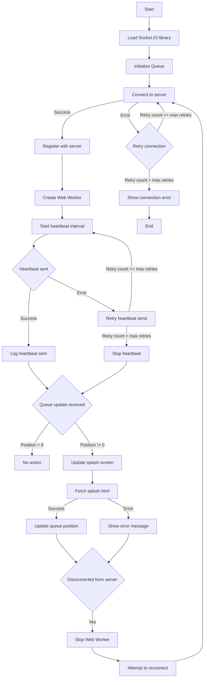

# E-queue

e-queue is a python/redis scalable queue system that allows users to join a queue and be served in a
first-come-first-serve basis.

## Install

### Install Redis on Windows:
https://redis.io/docs/latest/operate/oss_and_stack/install/install-redis/install-redis-on-windows/

### Install Redis Insight(GUI):
https://redis.io/insight/?utm_source=redisinsight&utm_medium=website&utm_campaign=install_redisinsight#insight-form

## Run Redis Server
From WSL run:
`sudo service redis-server start`

## Clone the repository and install the dependencies
Clone the repository and install the dependencies
`git clone https://github.com/mood-agency/e-queue.git`

`pip install -r requirements.txt`

`pip install flask-socketio`

`pip install eventlet`

### Development
`python app.py`

### Production
`gunicorn app:app --worker-class gevent --bind localhost:8000`

## Configuration
Use `.env` file to configure the application. You can copy the `.env.example` file and rename it to `.env`.
You can configure:
* The number of users that can be served at the same time.
* The timeout duration for the user to be served.

## Websocket and Worker connect and retry logic

## Splash Screen

Showed when the user get into the queue. You can modify the splash page by editing the `static/splash.html` file.

## Uploading Worker
We use a Cloudflare worker to check the user status in the queue and to send the user to the splash page if the user is in the queue.

### Set Up your Local Environment

`npm install -g wrangler`

After installing wrangler, you need to log in to your Cloudflare account:
`wrangler login`

### Create your worker

`wrangler generate cloudflare-worker`
`cd cloudflare-worker`

### Configure Your Worker

Edit the wrangler.toml file in your project directory to specify KV settings:

### Create the KV
From the cloudflare dashboard, got to `Workers and Pages -> KV -> Create Namespace`

After creating the KV, you can get the KV id from the KV settings page and add it to the wrangler.toml file.

```toml
name = "cloudflare-worker"
main = "src/index.ts"
compatibility_date = "2024-05-25"

kv_namespaces = [
  { binding = "SESSION_KV", id = "xxxxxxxxxxxxxxxxxxxxxxxxxxxxxxxx" }
]
```

### Deploy

`wrangler publish`

### Route the Worker
From the cloudflare dashboard, go to `Workers and Pages -> Add Route` an `*` to Route and select the worker you just created.


## Development

### Preview and Test

`wrangler dev cloudflare-worker/src/index.js`

## Debugging

### Queue status

To debug the queue status go to `http://localhost:5000/queue_status`

### Heartbeats

To debug the heartbeats go to `http://localhost:5000/debug_heartbeats?user_id=<user_id>`. You can find
the user_id in the queue status page.


## Testing
`python test.py` creates 100 users and adds them to the queue it raise an exception in case a user gets disconnected from the server. It should handle all the users without disconnections.

## TODO
[] Test reject user is already connected.


