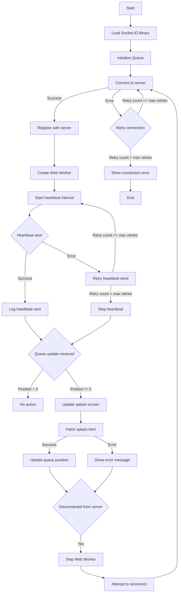

# E-queue

e-queue is a python/redis scalable queue system that allows users to join a queue and be served in a
first-come-first-serve basis.

## Install

`pip install flask-socketio`

`pip install eventlet`

To run the server, run
`python app.py`

# Websocket and Worker connect and retry logic

## Splash

You can modify the splash page by editing the `static/splash.html` file.

## Uploading Worker

### Set Up your Local Environment

`npm install -g @cloudflare/wrangler`
`wrangler login`

### Create your worker

`wrangler generate my-worker`
`cd my-worker`

### Configure Your Worker

Edit the wrangler.toml file in your project directory to specify your account details and settings:

* account_id: This can be found in your Cloudflare dashboard under the "Workers" tab.
* zone_id (optional): This is necessary if you are deploying your worker to a route associated with a specific domain.
* route (optional): If you want your worker to serve traffic for a specific route, specify it here.

```toml
name = "my-worker"
type = "javascript"

account_id = "your_account_id"
workers_dev = true  # Deploys to workers.dev subdomain; set to false if deploying to a custom route

# Uncomment and fill these out if deploying to a custom domain
# zone_id = "your_zone_id"
# route = "https://yourdomain.com/*"
```

### Preview and Test

`wrangler preview`

### Deploy

`wrangler publish`

## Debugging

### Queue status

To debug the queue status go to `http://localhost:5000/queue_status`

### Heartbeats

To debug the heartbeats go to `http://localhost:5000/debug_heartbeats?user_id=<user_id>`. You can find
the user_id in the queue status page.

